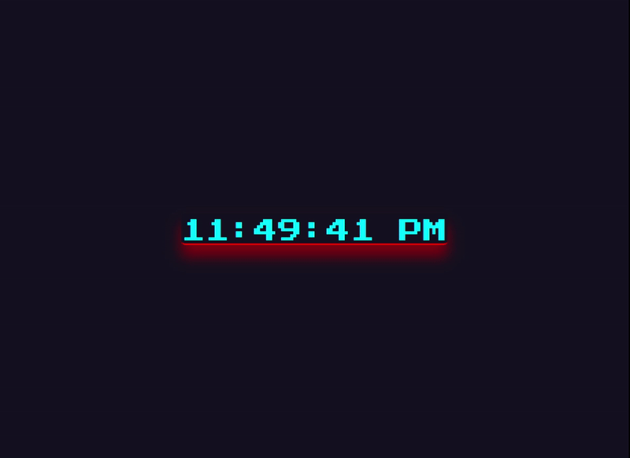

# digital-clock

## Table of contents

- [Overview](#overview)
  - [Description](#description)
  - [Project Skeleton](#project-skeleton)
  - [Screenshot](#screenshot)
  - [Links](#links)
- [My process](#my-process)
  - [Built with](#built-with)


## Overview

### Description

Project aims to create a digital clock.

### Project Skeleton

```
digital-clock (folder)
        |----index.html 
        |----style.css
        |----app.js                
```
### Screenshot

<p align="center">
<a href="https://sezginakgul.github.io/digital-clock/"></a>
</p>


### Links

- Live: [Live Website](https://sezginakgul.github.io/digital-clock/)


### Built with

- Semantic HTML5 markup
- CSS custom properties
- Flexbox
- Mobile-first workflow
- Styled Components - For styles
- CSS Colors-Border Properties
- CSS Margins-Padding
- CSS Properties for Texts-Font Families-Links
- CSS Overflow Property-The float Property-Opacity 
- Transparency-Units in CSS
- CSS Setting height and width-CSS Outline-CSS Combinators
- Javascript DOM
- Javascript Events
- Javascript Functions
- Import Google Fonts
- JS setInterval
- Comments

